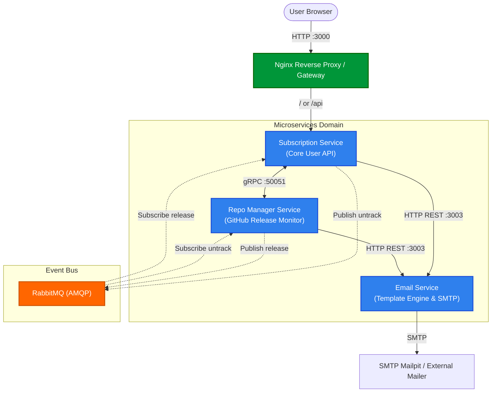
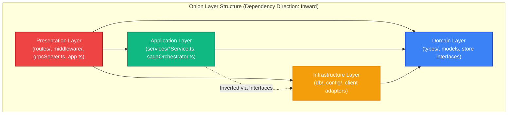
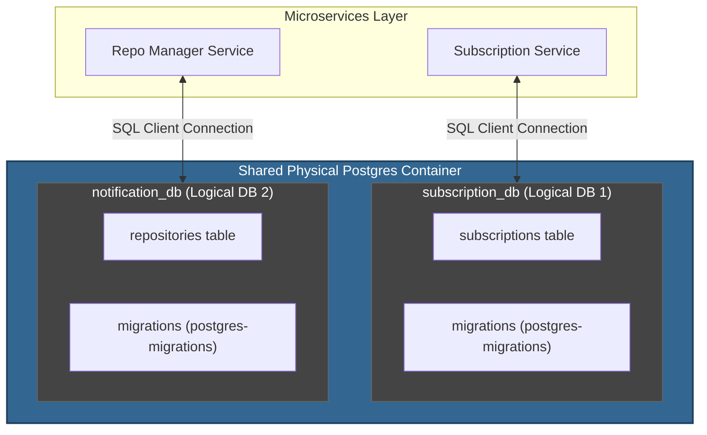
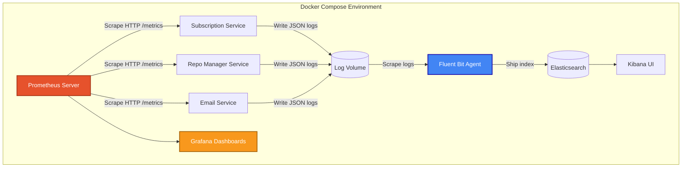

# GitHub Release Notification System - System Architecture

This document provides a multi-dimensional overview of the architecture of the **GitHub Release Notification System**, covering System, Application, Observability, and Data architecture views.

---

## 1. System (Macro) Architecture

Describes the high-level microservices topology, ingress routing, and inter-service communication protocols.

**Key Points:**
* **Nginx Gateway:** Acts as the single entry point, routing public API and frontend traffic to the subscription service.
* **Hybrid Communication:** Combines synchronous **gRPC** (high-throughput repository queries) and synchronous **HTTP REST** (stateless email dispatching).
* **Asynchronous Event-Driven Messaging:** Uses **RabbitMQ (AMQP)** to decouple actions like untracking repositories or broadcasting new release alerts.

---

## 2. Code (Micro) Architecture

Describes the internal software design pattern inside each microservice.

**Key Points:**
* **Strict Layering:** Code is separated into layers where dependencies point only inwards toward the core business domain.
* **Pure Domain Layer:** The core entities, models, and interfaces (`src/types/`) are pure TS and have no references to frameworks, routers, or database clients.
* **Automated Linting & Test Checks:** Validated in each service via custom architecture unit tests ([architecture.test.ts](file:///E:/Education/Genesis/software-engineering-school-6-0-NosarevAndrey-p/services/subscription-service/__tests__/unit/architecture.test.ts)) to prevent regression.

---

## 3. Data & Isolation Architecture

Describes the separation of concerns and storage partitioning.

**Key Points:**
* **Database-per-Service:** Complete schema isolation. Subscription and repository tables exist in separate databases (`subscription_db` and `notification_db`).
* **No DB-Level Joins:** Cross-service data queries are fetched exclusively through API boundaries (such as gRPC) rather than relational foreign keys.
* **Isolated Migrations:** Each service executes its own migrations independently on startup via `postgres-migrations`.

---

## 4. Infrastructure & Observability Architecture

Describes the telemetry stack, log parsing, and metric aggregation channels.

**Key Points:**
* **Centralized Logging:** Docker containers output JSON logs into shared volumes scraped by **Fluent Bit**, which forwards them to **Elasticsearch** for querying inside **Kibana**.
* **Centralized Metrics:** Services expose metrics in standard OpenTelemetry formats via `/metrics` paths, which are collected periodically by **Prometheus** and visualised in **Grafana**.
