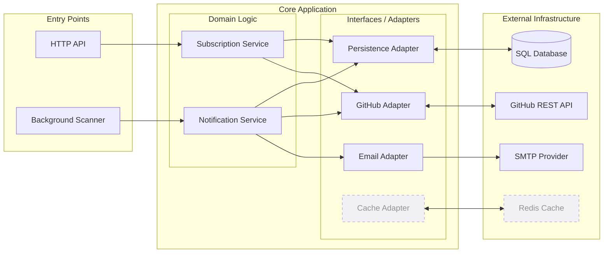
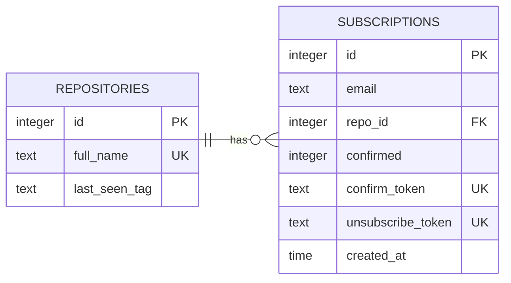

# GitHub Release Notification API System Design Document (SDD)

## Purpose
This document describes the architecture, main components, requirements, constraints and data model for the GitHub release notification service. It is intended to capture the design decisions for the current implementation and support future enhancements.

## System Overview
The service acts as an automated synchronization layer between GitHub’s release ecosystem and the end user. It provides a mechanism to track updates for any public repository through a state-managed subscription workflow. The system is responsible for validating repository metadata, managing a multi-stage user confirmation process, and executing periodic checks to ensure release data is accurately propagated to subscribers.

## Requirements

### Functional Requirements
1. Users can subscribe using email and GitHub repository in `owner/repo` format.
2. The service validates whether the repository exists on GitHub.
3. A confirmation email is sent after a successful subscription request.
4. The user must confirm the subscription using a token link.
5. Users can unsubscribe using an emailed token link.
6. Users can retrieve all active subscriptions for a given email.
7. The service periodically scans confirmed repositories and sends notifications for new releases.
8. When no confirmed subscriptions remain for a repository, repository tracking data may be removed.

### Non-functional Requirements
- The service must utilize a relational database for persistent state storage.
- All operational parameters, including security credentials and integration settings, must be managed through external environment variables.
- The application must be container-compatible, allowing for consistent deployment and execution across various environments. This includes providing a standardized orchestration configuration to manage service dependencies in a single lifecycle.
- The system must exhibit graceful degradation when encountering external service constraints, such as GitHub API rate limits. The service is required to handle these interruptions without system failure, returning standardized error responses to the client.
- The architecture must support automated testing at multiple levels. The service must maintain a minimum of 80% code coverage through a combination of unit and integration tests.

## Constraints
- The system’s operational throughput is strictly bound by the GitHub REST API rate limits.
- The system is designed to operate without requiring public-facing inbound endpoints (webhooks).
- The system uses polling for release detection rather than GitHub webhooks.
- The system architecture is a single service; no microservices are planned for MVP.
- The subscription workflow relies on token-based confirmation and unsubscribe links.

## High-Level Architecture

The service is organized using a layered architectural pattern that emphasizes the separation of concerns and the isolation of business logic from external infrastructure. This design ensures that the core domain remains decoupled from the specific implementation details of the GitHub API, SMTP providers, and database engines.

Figure 1: High-Level System Architecture and Data Flow

## Component Design

### Entry Points

- **RESTful API Gateway**: Serves as the primary interface for client interaction. It is responsible for request authentication, input schema validation (specifically for email formats and repository identifiers), and the mapping of HTTP verbs to domain actions.

- **Release Synchronization Scanner**: An autonomous process tasked with the temporal management of the system. It orchestrates the detection of new releases by traversing active repositories and triggering the notification pipeline when a state change is identified.

### Domain Services

- **Subscription Manager**: Encapsulates the core business logic for the subscription lifecycle. This includes the generation and verification of secure tokens, the management of double opt-in states, and the enforcement of business rules—such as preventing duplicate registrations and coordinating the cleanup of orphaned repository metadata.

- **Notification Orchestrator**: Manages the logic of "when" and "how" a user is notified. It correlates repository release data with confirmed subscriber lists to ensure that notifications are accurate, personalized for the specific release, and delivered only to verified participants.

### Infrastructure Adapters

- **GitHub Integration Adapter**: Provides a high-level interface for interacting with the GitHub REST API. It abstracts the complexities of repository validation, release metadata retrieval, and the handling of external constraints like rate limiting or network latency.

- **Email Dispatch Adapter**: A specialized interface for SMTP communication. It isolates the domain from the specifics of email templating and delivery protocols, ensuring that confirmation and notification messages are reliably queued for dispatch.

- **Persistence Adapter (Repository & Subscription)**: A unified data access layer that supports relational persistence. It utilizes an abstraction that allows the application to remain agnostic of the specific SQL backend, facilitating a seamless transition between local and production environments.

## Data Model

The persistence layer is designed to maintain referential integrity between tracked repositories and individual user subscriptions. The schema utilizes a normalized structure to prevent data redundancy and incorporates specific indexing strategies to support high-performance lookups during the background scanning and notification cycles.

## Future Directions

- Distributed Caching and Rate Optimization: Implementation of a caching layer (e.g., Redis) to manage transient GitHub metadata and maintain high-resolution rate-limit counters. This will reduce redundant outbound API calls and ensure the service operates within external provider quotas more efficiently.
- Architectural Decoupling and Workload Scaling: Transitioning the Background Scanner from an in-process interval to an independent worker or a queue-driven process. This decoupling would allow the notification engine to scale horizontally, independent of the API layer's resource consumption.
- Resilient Notification Delivery: Introduction of a message-broker-based delivery system (such as RabbitMQ or BullMQ). By moving SMTP dispatch to an asynchronous queue, the system would gain robust retry logic and fault tolerance against transient email server outages without impacting the core application flow.
- Hybrid Synchronization Models: Expanding the GitHub Adapter to support inbound webhooks. While the current polling mechanism ensures universal compatibility with any public repository, adding webhook support for high-traffic repositories would enable near real-time updates and further reduce the load on the GitHub REST API.

