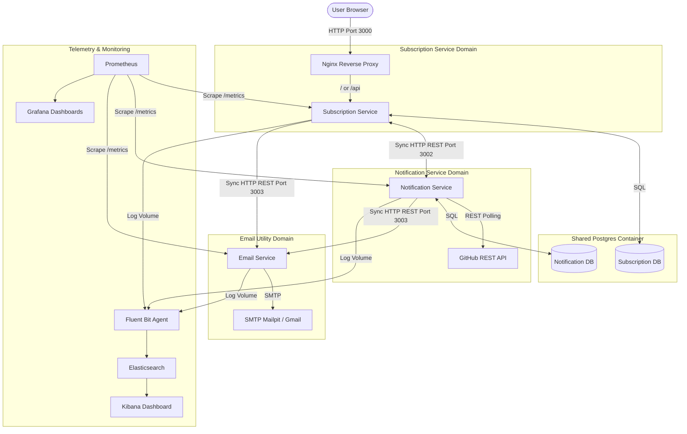

# GitHub Release Notification System - System Design Document (v2.0)

## Purpose
This document describes the v2.0 microservices architecture, components, communication patterns, and database layouts for the GitHub Release Notification System.

## System Overview
The system is divided into three separate service domains:
1. **`subscription-service`**: Handles user registrations, opt-in/opt-out status, dashboard loading, and serves the static frontend assets.
2. **`notification-service`**: Manages background scanning of tracked repositories on GitHub.
3. **`email-service`**: Centrally manages EJS template rendering and Nodemailer/SMTP email delivery.

A reverse proxy (Nginx) serves as the API gateway routing traffic to the `subscription-service`. Centralized metrics and logging are managed via Prometheus, Elasticsearch, Fluent Bit, and Grafana (EFK + Prometheus).

## High-Level Architecture

The following diagram illustrates the microservices split, reverse proxy routing, telemetry scraping, and the separation of logical databases residing in a shared physical Postgres container.

## Component Design

### 1. Subscription Service (`subscription-service`)
- **Web UI Dashboard**: Serves static HTML/JS assets from `/public`.
- **API Router**:
  - `POST /api/subscribe`: Initiates subscription, requests `notification-service` to track the repository, and triggers `email-service` to send confirmation email.
  - `GET /api/confirm/:token`: Confirms the subscription.
  - `GET /api/unsubscribe/:token`: Unsubscribes from the repository.
  - `GET /api/subscriptions?email=...`: Fetches active subscriptions for an email.
- **Internal APIs**:
  - `GET /api/internal/subscriptions?repo=...`: Exposes confirmed subscriber emails for a repository to the `notification-service`.

### 2. Notification Service (`notification-service`)
- **Background Scanner**: A cron loop that executes periodic repository release scans. If a repository has `0` active subscribers returned by the `subscription-service`, the scanner automatically purges it from tracking (self-healing logic).
- **Internal APIs**:
  - `POST /api/internal/repositories`: Validates existence on GitHub and adds repository to tracking.
  - `GET /api/internal/repositories?repo=...`: Returns metadata (like the last seen release tag).

### 3. Email Service (`email-service`)
- **SMTP Transporter**: Creates connection pools with SMTP servers.
- **EJS Template Renderer**: Compiles HTML emails using dynamic variables.
- **Internal APIs**:
  - `POST /api/internal/send-email`: Endpoint that accepts a target recipient, type (`confirmation` | `notification`), repository, and parameters, renders EJS, and dispatches via SMTP.
- **Config & Routing**:
  - Uniquely reads the `BASE_URL` configuration to bind email links (e.g. confirmation/unsubscribe anchors) back to the subscription service's public-facing address, completely decoupling other microservices from template formatting.

## Database Isolation & Schema Design

Each service owns its own database, schema, and migration history (via `postgres-migrations`).

### 1. `subscription_db` (Subscription Service Database)

#### Table: `subscriptions`
Stores subscription states by the raw string identifier of the repository (no foreign key to a repositories table).

| Column | Type | Constraints | Description |
| :--- | :--- | :--- | :--- |
| `id` | `SERIAL` | `PRIMARY KEY` | Unique identifier. |
| `email` | `VARCHAR(255)` | `NOT NULL` | Subscriber email address. |
| `repo_name` | `VARCHAR(255)` | `NOT NULL` | Target GitHub repository (e.g. `owner/repo`). |
| `confirmed` | `BOOLEAN` | `DEFAULT FALSE` | Verification state. |
| `confirm_token` | `UUID` | `NOT NULL` | Verification token. |
| `unsubscribe_token` | `UUID` | `NOT NULL` | Unsubscribe link token. |
| `created_at` | `TIMESTAMP` | `DEFAULT CURRENT_TIMESTAMP` | Time of subscription. |

*Unique constraint*: `(email, repo_name)`.

---

### 2. `notification_db` (Notification Service Database)

#### Table: `repositories`
Tracks repositories being scanned.

| Column | Type | Constraints | Description |
| :--- | :--- | :--- | :--- |
| `id` | `SERIAL` | `PRIMARY KEY` | Unique identifier. |
| `full_name` | `VARCHAR(255)` | `NOT NULL UNIQUE` | GitHub repository identifier (e.g. `owner/repo`). |
| `last_seen_tag` | `VARCHAR(100)` | `NULL` | Latest scanned tag. |

---

## Infrastructure & Telemetry

### Nginx reverse proxy
Nginx listens on port `3000` and forwards `/` and `/api` to the `subscription-service`. `/metrics` endpoints are blocked from public access.

### Fluent Bit Logging
Fluent Bit runs as a log scraper reading JSON log streams from separate Docker volumes:
- `subscription-logs` maps to `/var/log/app/subscription/*.log`
- `notification-logs` maps to `/var/log/app/notification/*.log`
- `email-logs` maps to `/var/log/app/email/*.log`

It pushes the parsed logs into Elasticsearch (`app-logs` index) which can be filtered in Kibana.

### Centralized BASE_URL Configuration
To easily configure public routing (like domain names or external proxy ports):
- Docker Compose defines a single, root-level environment interpolation:
  `BASE_URL=${BASE_URL:-http://localhost:3000}`
- This variable is passed **only** to the `email-service` container.
- The `subscription-service` and `notification-service` are completely decoupled from external address schemas, as they do not generate public links.

### Prometheus Metrics
Prometheus scrapes `/metrics` endpoints from all three services:
- `subscription-service:3000`
- `notification-service:3002`
- `email-service:3003`

And makes them available to Grafana dashboards.
